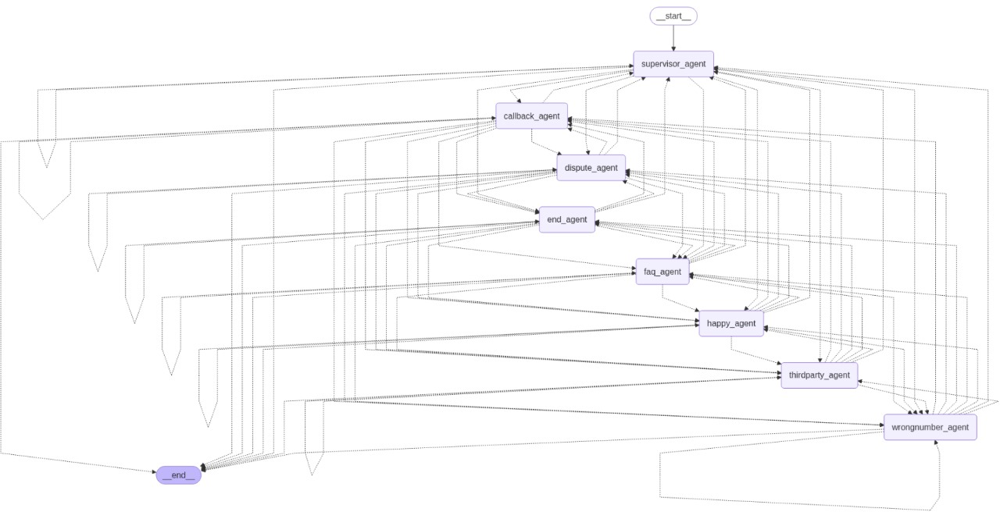

# Agentic-Voice-Assistant-LangGraph

A **production-ready, agentic AI framework** built using **LangGraph** for developing **voice-based multi-agent assistants**.  
This system enables **intelligent voice calling**, **loan collection**, **customer support**, and **multilingual AI conversations**, powered by **LLMs** and **agentic workflows**.

---

## 🚀 Features

- **Multi-Agent Supervisor Architecture**:  
  Coordinates specialized AI agents for calling, customer interaction, and knowledge retrieval.

- **Agentic AI Flows with LangGraph**:  
  Supports modular multi-agent logic and dynamic tool-calling.

- **RAG-Powered Conversations**:  
  Uses **vector databases** to provide context-aware, document-driven responses.

---

## 🧩 Agent Architecture

The system follows a **Supervisor → Multi-Agent** structure:

1. **Supervisor Agent**  
   - Decides which agent should handle the current user query.  
   - Routes between specialized agents using **LangGraph**.  

2. **Greeting/Onboarding Agent**  
   - Handles call greetings and initial customer onboarding.

3. **Clarification Agent**  
   - Handles queries like “Who is this?” / “Can you repeat?”  

4. **Happy/Confirmation Agent**  
   - Activated when a user confirms identity or responds positively.  

5. **Dispute Agent**  
   - Handles EMI disputes, loan verification issues, and escalates to seniors if needed.  

6. **Callback/Follow-up Agent**  
   - Schedules callbacks or notes unavailable users.  

7. **Knowledge Retrieval Agent**  
   - Integrates **RAG** via **FAISS/Pinecone** to answer customer-specific queries using PDFs, DOCX, and Excel files.  

> **Supervisor Flow Example:**  
> `Supervisor → Clarification Agent → Knowledge Agent → TTS/Call Output`

---

## 🖼 System Architecture

  

---

## 🛠 Technologies Used

- **Python 3.10+**
- **LangGraph** – Multi-agent orchestration
- **LangChain** – LLM pipelines & RAG
- **LLMs** – Groq LLaMA 3, Gemma-4B-IT (multilingual)
- **Vector Databases** – FAISS / Pinecone
- **FastAPI** – Backend & API integration
- **TTS & ASR Engines** – Voice interaction
- **FFmpeg** – Audio processing
- **Model Context Protocol (MCP)** – Context-aware multi-agent execution

---

